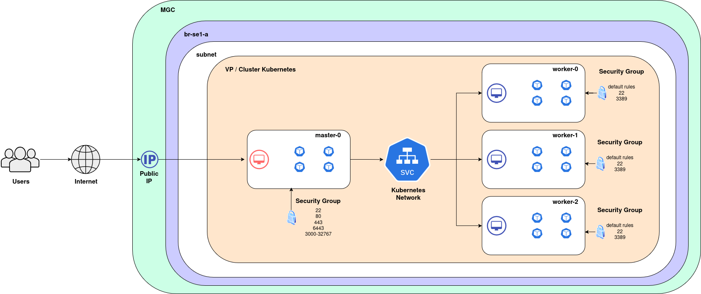
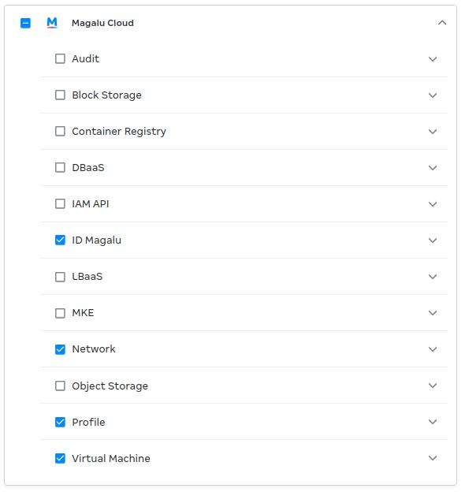

# MagaluCloud

Criação de máquinas virtuais (VM) na Magalu via Terraform que formarão um cluster Kubernetes 'baremetal'.

## Recursos que serão criados

Recursos que serão criados por default:

| Tipo | Descrição |
| --- | --- |
| [SubnetPool](./main/modules/subnet-pool/main.tf) | Define quais endereços IP estarão disponíveis para cada Subnet |
| [VPC](./main/modules/vpc/main.tf) | Rede Virtual Isolada dentro da Cloud na qual os recursos são criados |
| [Subnet](./main/modules/subnet/main.tf) | Divisão lógica dentro de uma VPC e que utilizará uma faixa de ips da subnetpool |
| [Security Group](./main/modules/security-group/main.tf) | Grupo de Segurança que sera adicionado ao master |
| [Public IP](./main/modules/public_ip/main.tf) | IP Público que será adicionado ao master |
| [Virtual Machine (1 CPU + 4 GB RAM + 40 GB disco)](./main/modules/virtual_machines/main.tf) | 1 virtual machine com Ubuntu 24.04 para o Master e 3 virtual machine com Ubuntu 24.04 para o Worker |

## Supersimplificação dos recursos criados



## Custos Estimados

### Virtual Machines

| VM | Tempo do ambiente ligado | Cálculo | Custo Parcial |
| :---: | :---: | :---: | :---: |
| 4 VMs (BV1-4-40) | 01h (04h total) | 0,1274 × 4h | R$ 0,5096 |
| 4 VMs (BV1-4-40) | 04h (16h total) | 0,1274 × 16h | R$ 2,0384 |
| 4 VMs (BV1-4-40) | 08h (32h total) | 0,1274 × 32h | R$ 4,0768 |
| 4 VMs (BV1-4-40) | 24h (96h total) | 0,1274 × 96h | R$ 12,2304 |
| 4 VMs (BV1-4-40) | 168h (7 dias / 672h total) | 0,1274 × 672h | R$ 85,6128 |
| 4 VMs (BV1-4-40) | 360h (15 dias / 1440h total) | 0,1274 × 1440h | R$ 183,456 |
| 4 VMs (BV1-4-40) | 720h (30 dias / 2880h total) | 0,1274 × 2880h | R$ 366,912 |

### Rede
| Recurso | Descrição | Preço |
| --- | --- | --- |
| VPC |  Tráfego de Saída | R$ 0.10 GiB/mês |
| VPC | Tráfego de Entrada | R$ 0.00 |
| NAT Gateway | Tráfego de Saída da SubnetPrivada para Internet via IP Público | R$ 0.10 GiB/mês |

## Requisitos

### 1 - Terraform 

Instale o cli utilizando a [documentação oficial da hashicorp](https://developer.hashicorp.com/terraform/install)

### 2 - API Key

#### 2.1 - Crie uma apikey utilizando os passos da [documentação oficial da MagaluCloud](https://docs.magalu.cloud/docs/devops-tools/api-keys/how-to/object-storage/create-api-keys/)

2.1.1 - No menu **Magalu Cloud** selecione as permissões abaixo:




#### 2.2 - Insira a apikey na propriedade [api_key](./main/terraform.tfvars#L1) do arquivo tfvars

## Criação das VMs

A partir da raiz do projeto

#### 1 - Prepare o ambiente localmente

```bash
chmod +x scripts-sh/1-local-startup.sh
./1-local-startup.sh
```

Será gerado o arquivo [scripts-sh/pwd_user_ubuntu.txt](./scripts-sh/pwd_user_ubuntu.txt) em *plaintext* com a senha de acesso do usuário **ubuntu** de todas as VMs.

#### 2 - Inicialize o terraform:

Estando no diretório "modulos-magalu-cloud/main" execute:

```bash
terraform init
```

#### 3 - Verifique se as configurações estão corretas:

```bash
terraform plan
```

#### 4 - Crie os recursos:

```bash
terraform apply
```

## Teste de acesso à máquina Master

### 1 - Teste o acesso ao master-0 via chave ssh:

```bash
bash -c "$(terraform output --raw vm_master_ssh_command)"
```

### 2 - Teste o acesso ao master-0 com a senha gerada anteriormente:

```bash
ssh ubuntu@$(terraform output --raw vm_master_public_ip)
```

### 3 - Teste o acesso **master-0 -> worker** 

A partir do master-0, substitua **ip_interno_worker** por um ip válido e utilize a senha do arquivo [scripts-sh/pwd_user_ubuntu.txt](./scripts-sh/pwd_user_ubuntu.txt):

```bash
ssh ubuntu@ip_interno_worker
```

## Criação das chaves SSH internas

Essas chaves serão utilizadas de forma interna pelos hosts

### 1 - Acesse o master-0

#### 1.1 - Gere um novo par de chaves ssh

```bash
ssh-keygen -t rsa -f ~/.ssh/chave_ssh_k3s -b 4096 -C "chave_ssh_k3s"
```

#### 1.2 - Copie a chave ssh para o próprio master-0

Utilize a senha do arquivo [scripts-sh/pwd_user_ubuntu.txt](./scripts-sh/pwd_user_ubuntu.txt):

```bash
ssh-copy-id -i /home/ubuntu/.ssh/chave_ssh_k3s.pub ubuntu@localhost
```

#### 1.3 - Copie a chave ssh para os demais workers

Utilize a senha do arquivo [scripts-sh/pwd_user_ubuntu.txt](./scripts-sh/pwd_user_ubuntu.txt) e substitua **ip_interno_worker** por um ip válido:

```bash
ssh-copy-id -i /home/ubuntu/.ssh/chave_ssh_k3s.pub ubuntu@ip_interno_worker
```

## Criação do cluster Kubernetes com K3S

### 1 - A partir do master-0 

#### 1.1 - Instale o k3sup

```bash
wget https://github.com/alexellis/k3sup/releases/download/0.13.10/k3sup
sudo install k3sup /usr/local/bin/
```

Cheque a instalação:

```bash
k3sup --help
```

#### 1.2 - Inicie o cluster 

Execute os comandos abaixo no master-0:

```bash
k3sup install --local --context default --no-extras --k3s-version  v1.32.6+k3s1
```

Visualize o estado do cluster:

```bash
export KUBECONFIG=`pwd`/kubeconfig
kubectl get node -o wide
```

Realize o join:

- Troque **IP_INTERNO_WORKER** pelo ip do worker em questão

```bash
export AGENT_IP=IP_INTERNO_WORKER
export SERVER_IP=$(hostname -I | cut -d ' ' -f1)
echo $AGENT_IP $SERVER_IP
```

Faça o join:

```bash
k3sup join --ip $AGENT_IP --server-ip $SERVER_IP --user ubuntu --ssh-key /home/ubuntu/.ssh/chave_ssh_k3s --k3s-version  v1.32.6+k3s1
```

Repita 1.3 e 1.4 para os demais workers

### 2 - Resultado

```
NAME       STATUS   ROLES                  AGE     VERSION        INTERNAL-IP   EXTERNAL-IP   OS-IMAGE             KERNEL-VERSION     CONTAINER-RUNTIME
master-0   Ready    control-plane,master   2m32s   v1.32.6+k3s1   10.0.0.8      <none>        Ubuntu 24.04.2 LTS   6.8.0-60-generic   containerd://2.0.5-k3s1.32
worker-0   Ready    <none>                 25s     v1.32.6+k3s1   10.0.0.14     <none>        Ubuntu 24.04.2 LTS   6.8.0-60-generic   containerd://2.0.5-k3s1.32
worker-1   Ready    <none>                 6s      v1.32.6+k3s1   10.0.0.5      <none>        Ubuntu 24.04.2 LTS   6.8.0-60-generic   containerd://2.0.5-k3s1.32
```

## Remoção

### 1 - Remova os recursos quando necessário:

Estando no diretório "modulos-magalu-cloud/main" execute:

```bash
terraform destroy --auto-approve
```